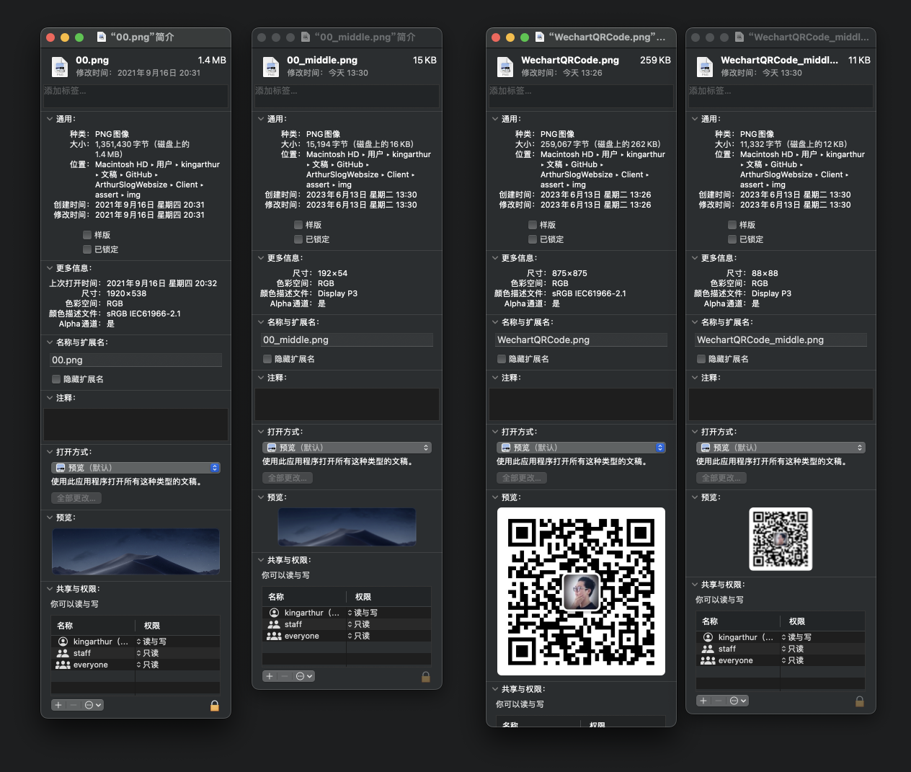
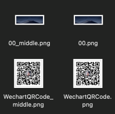

[Arthurslog.com](http://www.arthurslog.com)/[@Medium](https://medium.com/@ArthurSlog)/[@GitHub](https://github.com/BlessedChild/ArthurSlog)

Slog108｜Year·5

Guangzhou China
May 13th 2023

# Optimize the visual effect and loading speed of the interface（skill）

**Achievement**
At the slow network speed, the loading speed of the interface background image can basically show all the low-resolution visual effects to the user within 1s, which increases the transition and improves the user's experience when waiting for the best visual effects to be displayed.

key point:
``` js

```

Compressing image resources reduces file size, and appropriately numbered file names are classified and loaded according to the life cycle of the interface.

Comparison before and after compression：


Classified and numbered documents:


**Refrence**
https://stackoverflow.com/questions/27191267/what-is-the-best-alternative-to-the-deprecated-lowsrc-for-images

---

> Always keep in mind the principle of productization

Thanks to the friends who provided valuable information